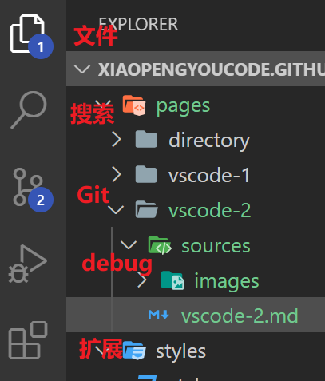

# vscode 的使用简介

首先，想让vscode发挥全部作用，我们需要**工作区**这个概念，简单来说，就是让vscode去打开一个文件夹，而不是打开一个文件，具体操作如下

1. 在文件资源管理器下打开目标文件夹
2. 右键点击文件夹空白位置
3. 最下面 **显示更多选项**
4. 然后 **通过code打开**(如果安装没有操作错误，应该是有这个选项的)

**建议给我们的项目单独准备一个文件夹**

我也不知道这些区域叫啥，但是，最上面一栏就是各种命令，这个大家自行探索

## 中间左边五个按钮

- 最上面是文件，打开就会显示右边的文件区，功能等同于一个小文件夹
- 然后是搜索，可以搜索当前工作区下的各种内容
- 然后是 `Git`，一个版本管理装置，目前还用不到，我也正在学
- `debug`，调试，可能会用到，就是测试的意思
- 最后一个是扩展，理论上来说，`vscode` 就像一个文本编辑器，但是安装各种扩展之后，才能发挥出他的强大

安装扩展直接在搜索矿里搜就行

- 中文简体 -- 图标是个地球
- c/c++
  
- python

目前就这三个，之后大家有需要可以再装

## 写代码

大家可以在

这里，第一个是新建文件，第二个是新建文件夹，然后去组织文件系统，如果要新建一个c语言文件，要新建 `name.c`，新建一个python文件，要新建 `name.py`。

然后右边就可以写了

vscode自带了一个工具叫 `IntellSense`，可以根据上下文自动帮大家补全代码

代码的运行实现起来比较复杂，之后再跟大家说

## 账户和设置

大家可以登录自己的微软账户或者github账户

然后设置里我们常用的就是主题（设置 -> 颜色主题），大家可以调一个自己喜欢的主题